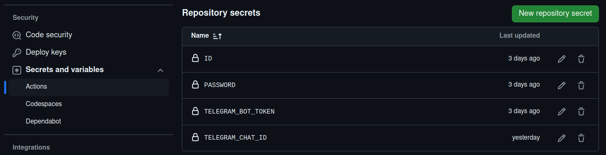

# deadline-notifier ⏰

> [!WARNING]
> It works only for students of Inha University in Tashkent!

## Table of Contents 📋

- [About the Project](#about-the-project)
- [Technologies Used](#technologies-used)
- [Setup and Installation](#setup-and-installation)
- [Project Structure](#project-structure)
- [Contributing](#contributing)
- [License](#license)

## About the Project

It is nothing but a simple application written in `java` that scrapes data with `selenium` and notifies about the upcoming deadlines for today via telegram bot.

## Technologies Used

- **Java SE-11**: Language used for writing the application.
- **Selenium WebDriver 4.17.0**: For browser automation & scraping.
- **Maven 3.6.3**: Build and dependency management tool.
- **WebDriver Manager 5.8.0**: For automatic browser driver management (setup).
- **GitHub Actions**: To continiously run the project and send the output via telegram bot once a day.

## Setup and Installation

> [!IMPORTANT]
> Actually, you don't need to install & run it locally. You just need to fork this repo on GitHub and add 4 repository secrets & create a telegram bot by yourself to get the benefit of this project. And it will itself notify you about your forthcoming deadlines for today(Assignment, Quiz, Video, which means all type of deadlines) and later (available only for videos)!

> [!NOTE]
> When forking, do not forget to fork from the master branch as it is the one you need. In the dev branch, i usually test some modifications that may be upcoming.

These are the very 4 repository secrets:


- **ID** - your student ID to login (U2....).
- **PASSWORD** - your password for eclass.
- **TELEGRAM_BOT_TOKEN** - your own bot token to notify you daily about the deadlines. You get it from @BotFather after creating your bot.
- **TELEGRAM_CHAT_ID** - the id of your telegram chat that your bot will be sending messages in. It can be your telegram profile id or your group id - if you want to share it with your classmates as you guys have the same deadlines. If you are from CSE 22-03, you are lucky, so you don't have to worry, we are in the same group. It will be added to our telegram group, IMMEDIATELY. (upd: added✅)

> [!TIP]
> For TELEGRAM_CHAT_ID, you usually get this via `getUpdates()` endpoint of Telegram Bot API. But make sure to add your bot to your group, give the privilege to read messages by giving the admin rights and tag the bot and type the `/start` command. Here is how you can send a request to `getUpdates()` endpoint with curl:
```bash
curl -s -X GET "https://api.telegram.org/bot<YOUR_BOT_TOKEN>/getUpdates"
```
From the response you can get your TELEGRAM_CHAT_ID!
## Project Structure

- `src/main/java/eclass/kr`: Contains the main application code.
  - **`DeadlineNotifier.java`**: The primary class that performs the web scraping and automation tasks.
  - **`Constants.java`**: Contains the static variables that will never change dynamically.
- Key methods in `DeadlineNotifier.java`:

  - `setup()`: Initializes the WebDriver and sets Chrome options.
  - `login()`: Logs into the e-class website using credentials stored in repository secrets.
  - `action()`: Retrieves and processes deadlines and event data from the page & does the whole action (mess).
  - `sleep()`: Customized (Overriden) version of Thread.sleep(long milliseconds) method.
  - `printCurrentDate()`: Prints today's date to console.
  - `parseDeadline()`: Gets the deadline string and cuts & trims & makes it 'odambashara'.
  - `printInfo()`: Prints the core message & events' list.
  - `printNoDeadlineMessage()`: naming speaks for itself!
  - `tearDown()`: Closes the WebDriver and cleans up resources.

- `.github/workflows/ci-cd.yml`:
  - put on scheduled cron, that runs the project at around 7 am (which you can also modify by yourself if you want) and sends a request to a telegram bot api with curl every day.

## Contributing

You can contribute to the project at any point! If you'd like to, please follow these steps:

1. **Fork the repository**

2. **Clone the repository**:

   ```bash
   git clone https://github.com/<your-username>/deadline-notifier.git
   ```

3. **Ensure you have the following installed**:

   - **Java Development Kit (JDK) 8 or higher (in my case it is 11)**: Required to compile and run the Java code. [Download jdk here](https://www.oracle.com/java/technologies/javase-downloads.html).
   - **Maven**: Build tool used to manage project dependencies and to run the application. [Install Maven here](https://maven.apache.org/install.html).

4. **Set up environment variables for login credentials**:

   - Create two environment variables, `ID` and `PASSWORD`, that will be used for authentication for local runs:
     - On **Windows**:
       ```bash
       setx ID "your-username"
       setx PASSWORD "your-password"
       ```
     - On **Linux/Mac** (add these to your `.bashrc` or `.zshrc` file):
       ```bash
       export ID=your-username
       export PASSWORD=your-password
       ```
   - Or you can just save them in your .env file, like I do in my local runs.

5. **Install project dependencies (Maven)**:

   - Navigate to the project directory:
     ```bash
     cd /<your-projects-folder-name>/deadline-notifier
     ```
   - Run the following command to download all required dependencies:
     ```bash
     mvn clean install
     ```

6. **WebDriver Setup**:

   - The project uses **WebDriverManager** for automatic driver management. It automatically downloads the appropriate browser driver (e.g., ChromeDriver in my case) for the version of the browser you are using. So you don't need to worry about downloading the drivers and selenium server manually.

7. **Configure Chrome Options**:

  > [!TIP]
  > When running locally, do not forget to put some chrome options into a comment like this:

   ```java
   public static void setup() {
                WebDriverManager.chromedriver().setup();
                ChromeOptions options = new ChromeOptions();
                String arguments[] = {
                                "--remote-allow-origins=*",
                                "--no-sandbox",
                                "--disable-dev-shm-usage",
                                // "--headless",
                                // "--remote-debugging-port=9222"
                };
                options.addArguments(arguments);
                driver = new ChromeDriver(options);
        }
   ```

   As it will allow you to see it visually running the browser, going to the eclass website, so on... By default, all of these 5 options are added since it requires the headless mode and remote debugging port when running in cloud.

8. **Compile the project**:
    ```bash
    mvn compile
    ```
9. **Run the project**:

   - To run the project, simply execute the main class:
     ```bash
     mvn exec:java -Dexec.mainClass="eclass.kr.DeadlineNotifier"
     ```
   - If it does not work, in the worst case, you can manually show your ID and PASSWORD variables like:

     ```bash
     ID=<your-id> PASSWORD=<your-password> mvn exec:java -Dexec.mainClass="eclass.kr.DeadlineNotifier"
     ```

   - **Verify the output**:
     - After running the program, the output will be displayed in the console, showing whether there are upcoming events, deadlines, and other related information.

10. At the end of the day, just push your changes and open a pull request to be merged.

## License

This project is licensed under the MIT License (Modified for Non-Commercial Use). See the [LICENSE](./LICENCE) file for details.